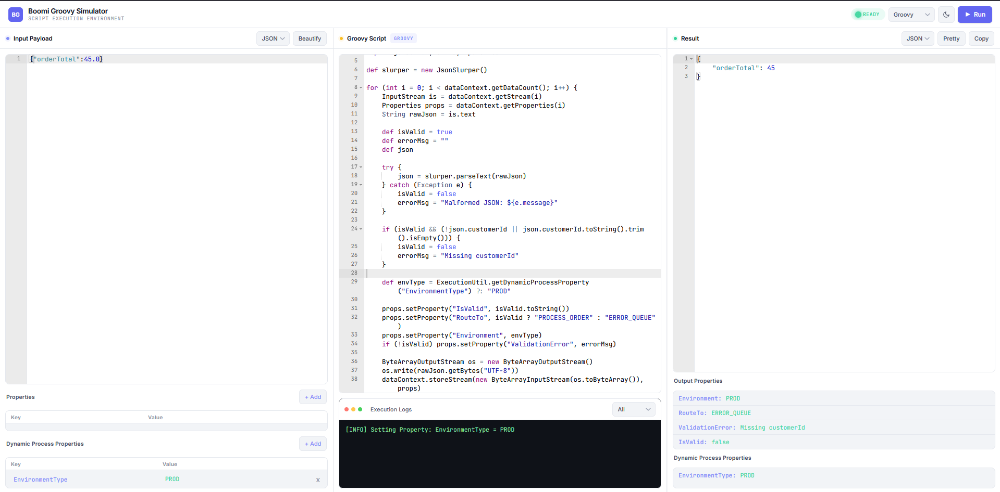
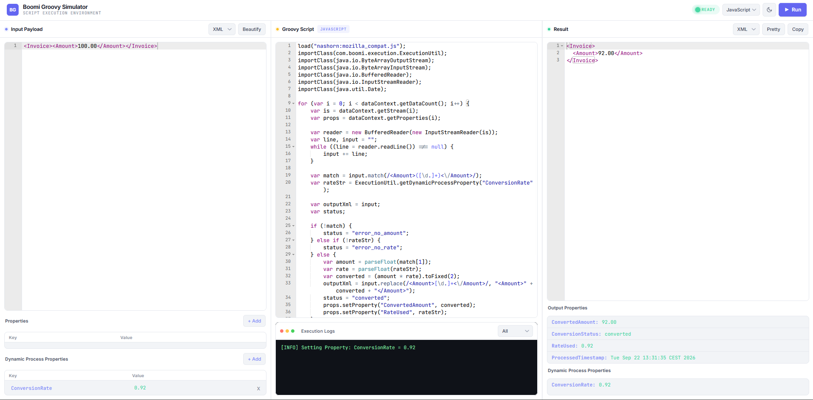
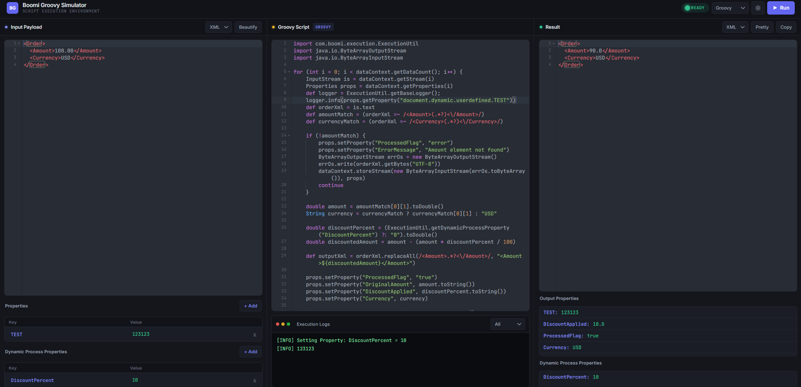

# Groovy Simulator for Boomi

A local sandbox for iterating on Boomi custom-scripting shape logic without
deploying anything to a Boomi runtime. Paste a payload, write a Groovy or
JavaScript script that consumes `dataContext` / `ExecutionUtil` the same way
a real Boomi Data Process shape would, run it, and inspect the output(s),
properties, and log output in a browser.

> **Security:** this application evaluates arbitrary user-supplied source
> code on the host that runs it. This is intentional — it is the whole point
> of the tool — but it means every deployment must be treated as capable of
> remote code execution against the host. Read [SECURITY.md](SECURITY.md)
> before running it anywhere other than `127.0.0.1` on your own machine.
> **Do not** put it behind a public URL, and **do not** deploy it to a cloud
> VM with an attached IAM role.

## Screenshots







## What it gives you

- **Web UI** at `http://localhost:8080/` with three side-by-side panels:
  input payload, script, and result.
- **Groovy** runtime backed by `GroovyShell` with the Boomi-style auto-imports
  (`XmlSlurper`, `JsonSlurper`, `ExecutionUtil`).
- **JavaScript** runtime backed by the JDK `ScriptEngineManager` (Nashorn).
- **`dataContext`** with the Boomi-shape API: `getDataCount()`, `getStream(i)`,
  `getProperties(i)`, `storeStream(is, props)`.
- **`ExecutionUtil`** with `getDynamicProcessProperty` / `setDynamicProcessProperty`
  and a `logger` that captures INFO / WARNING / SEVERE lines into the UI's
  Execution Logs panel.
- **Result pagination** — a script may call `dataContext.storeStream(...)`
  many times; the Result panel shows a `‹ 1 / N ›` pager to page through
  every emitted payload and its per-payload properties.
- **10-second hard execution timeout** on both runtimes; the Groovy path also
  gets `@ThreadInterrupt` so tight loops actually get interrupted. See
  [SECURITY.md](SECURITY.md) for the JavaScript caveat.
- **Local browser cache** of the last payload, script, and property tables
  so a refresh doesn't lose work.

## Running in dev mode

```shell
./mvnw quarkus:dev
```

Then open <http://localhost:8080/>. Ctrl+Enter in the script editor runs.

## Packaging

```shell
./mvnw package
java -jar target/quarkus-app/quarkus-run.jar
```

## Docker

Four Dockerfiles are provided under `src/main/docker/`:

| File | Image |
| --- | --- |
| `Dockerfile.jvm` | JVM mode on `ubi9/openjdk-21` |
| `Dockerfile.legacy-jar` | JVM mode with the legacy fat-jar layout |
| `Dockerfile.native` | Native image on `ubi9/ubi-minimal` |
| `Dockerfile.native-micro` | Native image on `ubi9-quarkus-micro-image` |

JVM build:

```shell
./mvnw package
docker build -f src/main/docker/Dockerfile.jvm -t groovy-simulator-for-boomi .
docker run --rm -p 127.0.0.1:8080:8080 groovy-simulator-for-boomi
```

Note the `127.0.0.1:` prefix on the port publish. Without it, Docker will
bind the sandbox to every interface on the host. Do not do that.

For extra containment on a shared machine:

```shell
docker run --rm \
    --network=none \
    --read-only \
    --cap-drop=ALL \
    -p 127.0.0.1:8080:8080 \
    groovy-simulator-for-boomi
```

`--network=none` disables outbound network from inside the container, which
neutralises the "pasted script exfiltrates via HTTP" class of abuse.

## HTTP API

Both endpoints accept the same JSON body:

```json
{
  "payload":                "<request payload passed to dataContext>",
  "script":                 "<base64-encoded script source>",
  "props":                  { "some.doc.property": "value" },
  "dynamicProcessProperty": { "some.process.property": "value" }
}
```

Endpoints:

- `POST /boomi/groovy` — Groovy runtime.
- `POST /boomi/javascript` — JavaScript runtime.

Response:

```json
{
  "logs":                   "combined ExecutionUtil logger + println output",
  "results":                ["payload 1", "payload 2", "..."],
  "outputPropsList":        [ { "prop.for.payload.1": "..." }, { "...": "..." } ],
  "dynamicProcessProperty": { "final.process.property.map": "..." }
}
```

## License

MIT — see [LICENSE](LICENSE).

## Trademarks

Groovy Simulator for Boomi simulates aspects of the custom-scripting runtime
used by Boomi, LP's iPaaS platform, for developer testing purposes only. Boomi
is a trademark of Boomi, LP. This project is not affiliated with, sponsored
by, or endorsed by Boomi, LP.
